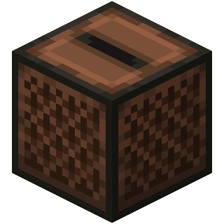
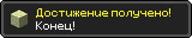

<!DOCTYPE html>
<html lang="ru">
<head>
    <meta charset="UTF-8">
    <meta name="viewport" content="width=device-width, initial-scale=1.0">
    <title>CODECRAFT</title>

    <link rel="stylesheet" href="style.css?v=10">
</head>
<body>

    <video autoplay muted loop id="bg-video">
        <source src="assets/background.mp4" type="video/mp4">
    </video>

    

    <audio id="music-player" src="assets/menu.mp3" loop></audio>
<audio id="achievement-sound" src="assets/achievement.mp3"></audio>

    

    

        Музыка
        <strong id="track-name">Главное меню</strong>
    

    

    <section class="hero" id="top" data-track="menu">
        

            <h1>CODECRAFT</h1>
            
Загрузка...

        

        <h2>Портфолио про меня, мои цели и мои проекты</h2>

        

            <a href="#about"><button>Обо мне</button></a>
            <a href="#works"><button>Мои работы</button></a>
        

    </section>

    

    <main>
        <section id="about" class="site-section" data-track="story">
            

                

                    
Игрок 01

                    <h2>Дильназ</h2>
                    

                        Привет! Я изучаю программирование, создаю сайты, пробую Python,
                        работаю с Roblox Studio и люблю Minecraft. Этот сайт — моё
                        портфолио для конкурса CAP Education «Обо мне».
                    

                    

                        <h3>Моя история</h3>
                        

                            Всё началось с сильного интереса к программированию. Сначала
                            были курсы на YouTube, первые попытки повторять за авторами и
                            желание делать что-то своё. Эта мотивация перешла и к моей
                            маленькой команде — Расулу и Инабат, сыну и дочери моего дяди.
                        

                        

                            Мой дядя разбирается в программировании как свои пять пальцев.
                            Первым рабочим инструментом стал мой старый ноутбук: нужные
                            программы на нём работали, но с лагами. Скрипты писались
                            буквально с молитвой, зато мы не сдавались и вместе сделали
                            игру в Roblox Studio.
                        

                        

                            Дядя увидел наш интерес и поверил в наше будущее. Он записал нас
                            на CAP Education, а позже купил мне мощный компьютер. Мы вместе
                            собрали его, установили Windows, и обучение продолжилось уже без
                            тех самых лагов.
                        

                        

                            На курсе Python Junior есть Pygame и Turtle. А ещё стало
                            понятно, насколько важны хорошие менторы: они вежливо объясняют,
                            помогают исправлять ошибки, проводят отдых и викторины, поэтому
                            учиться становится намного интереснее.
                        

                    

                

                

                    
Формат Python Junior

                    
Навык Lua · Python · HTML

                    
Стиль Minecraft portfolio

                

            

        </section>

        <section id="blocks" class="site-section alt" data-track="adventure">
            

                
Квест конкурса

                <h2>8 блоков портфолио</h2>

                

                    <article class="info-card">
                        01
                        <h3>Кто я</h3>
                        
Ученик, который учится делать реальные проекты и постепенно собирает своё портфолио.

                    </article>

                    <article class="info-card">
                        02
                        <h3>Моя цель</h3>
                        
Стать сильнее в разработке, научиться делать игры и полезные программы.

                    </article>

                    <article class="info-card">
                        03
                        <h3>Как залетел в CAP Edu</h3>
                        
После нашей игры в Roblox Studio дядя увидел мой интерес и записал меня на курс.

                    </article>

                    <article class="info-card">
                        04
                        <h3>Мой ментор</h3>
                        
Менторы CAP Edu объясняют понятно, помогают исправлять ошибки и поддерживают на занятиях.

                    </article>

                    <article class="info-card">
                        05
                        <h3>Путь А → Б</h3>
                        
Сначала был старый ноутбук с лагами, а теперь я собираю свою программу и учусь дальше.

                    </article>

                    <article class="info-card">
                        06
                        <h3>Хобби</h3>
                        
Minecraft, Roblox Studio, игры, идеи для проектов и эксперименты с кодом.

                    </article>

                    <article class="info-card">
                        07
                        <h3>Лучшие работы</h3>
                        
Сайты, мини-игры, Python-проекты и всё, что показывает мой прогресс.

                    </article>

                    <article class="info-card">
                        08
                        <h3>GitHub</h3>
                        
После загрузки проекта сюда добавлю ссылку на репозиторий.

                    </article>
                

            

        </section>

        <section id="goal" class="site-section" data-track="creative">
            

                

                    
Цель

                    <h2>Куда я иду</h2>
                    

                        Я хочу научиться создавать проекты, которыми можно пользоваться:
                        сайты, игры, и программы на Python. Моя цель —
                        не просто смотреть уроки, а собирать свои идеи до рабочего результата.
                    

                

                

                    <h3>Мой текущий квест</h3>
                    <ul>
                        <li>Доделать портфолио</li>
                        <li>Залить проект на GitHub</li>
                        <li>Снять короткий видео-обзор</li>
                    </ul>
                

            

        </section>

        <section id="path" class="site-section alt" data-track="cave">
            

                
Путь А → Б

                <h2>Мой прогресс</h2>

                

                    

                        Было
                        
Старый ноутбук, лаги и первые скрипты, которые я писал почти с молитвой.

                    

                    

                        Сейчас
                        
Курс CAP Education, Python, Апгрейд мозга, Turtle и свой сайт-портфолио.

                    

                    

                        Будет
                        
Больше игр, GitHub, деплой и проекты, которыми можно гордиться.

                    

                

            

        </section>

        <section id="works" class="site-section" data-track="pigstep">
            

                
Инвентарь

                <h2>Мои работы</h2>

                

                    <article class="work-card grass">
                        <h3>CODECRAFT</h3>
                        
Этот сайт-портфолио в стиле Minecraft: HTML, CSS и JavaScript.

                    </article>

                    <article class="work-card stone">
                        <h3>Python-проекты</h3>
                        
Небольшие программы и задания, которые помогают мне прокачивать логику.

                    </article>

                    <article class="work-card wood">
                        <h3>Roblox Studio</h3>
                        
Первая командная игра вместе с Расулом и Инабат — проект, с которого началась история.

                    </article>
                

            

        </section>

        <section id="github" class="site-section alt" data-track="finale">
            

                
Финальный этап

                <h2>GitHub и сдача</h2>
                

                    Следующий шаг — загрузить сайт на GitHub и добавить сюда настоящую ссылку
                    на репозиторий. Потом останется записать видео-обзор на 1–2 минуты.
                

                <a class="pixel-link" href="#top">Вернуться наверх</a>
            

        </section>
    </main>

    

</body>
</html>

const splashTexts = [
    "упай-чокопай",
    "Здесь могла быть ваша реклама!",
    "Упал-вставай, встал-упай",
    "Welcome to CAP Edu!",
    "Python inside!",
    "Лагает, но работает!",
    "Python everywhere!",
    "Портфолио!",
    "Менеджер проектов!",
    "Сделано с любовью!",
    "GitHub soon!",
    "Technoblade never dies!",
    "Серьезно, кто-то это читает?"
];

// Случайная желтая надпись
const randomText =
    splashTexts[Math.floor(Math.random() * splashTexts.length)];

document.getElementById("splash").textContent = randomText;

// ===== МУЗЫКА =====

const music = document.getElementById("music-player");
const musicButton = document.getElementById("music-toggle");

music.volume = 1;

let musicPlaying = false;

musicButton.addEventListener("click", () => {

    if (!musicPlaying) {
        music.play();
        musicPlaying = true;
    } else {
        music.pause();
        musicPlaying = false;
    }

});

music.addEventListener("ended", () => {
    musicPlaying = false;
});

// ===== ПЛАВНОЕ ЗАТИХАНИЕ =====

window.addEventListener("scroll", () => {

    const maxScroll =
        document.body.scrollHeight - window.innerHeight;

    const progress =
        window.scrollY / maxScroll;

    // Громкость от 100% до 10%
    music.volume = Math.max(0.1, 1 - progress);

});

// ===== ДОСТИЖЕНИЕ =====

const achievement =
    document.getElementById("achievement");

const achievementSound =
    document.getElementById("achievement-sound");

    achievementSound.volume = 0.3;

let shown = false;

function showAchievement() {

    achievement.classList.add("show");

    achievementSound.currentTime = 0;
    achievementSound.play();

    setTimeout(() => {
        achievement.classList.remove("show");
    }, 7640);

}

window.addEventListener("scroll", () => {

    const bottom =
        window.innerHeight +
        window.scrollY >=
        document.body.offsetHeight - 100;

    // Показываем достижение
    window.addEventListener("scroll", () => {

    const bottom =
        window.innerHeight +
        window.scrollY >=
        document.body.offsetHeight - 100;

    if (bottom && !shown) {

        shown = true;

        music.volume = 0;

        showAchievement();

    }

});

});

@font-face {
    font-family: 'MinecraftLogo';
    src: url('assets/Minecraft.ttf') format('truetype');
}

@font-face {
    font-family: 'MinecraftText';
    src: url('assets/Tiny5-Regular.ttf') format('truetype');
}

*{
    margin:0;
    padding:0;
    box-sizing:border-box;
}

html{
    scroll-behavior:smooth;
}

body{
    font-family:'MinecraftText',Arial,sans-serif;
    background:#1f241f;
    color:#f7f7f7;
    font-size:24px;
    line-height:1.25;
}

a{
    color:inherit;
    text-decoration:none;
}

#bg-video{
    position:fixed;
    top:0;
    left:0;
    width:100%;
    height:100%;
    object-fit:cover;
    z-index:-2;
}

.overlay{
    position:fixed;
    inset:0;
    background:
        linear-gradient(rgba(38,60,91,.35),rgba(20,22,18,.78)),
        rgba(0,0,0,.35);
    z-index:-1;
}

.hero{
    min-height:100vh;
    display:flex;
    flex-direction:column;
    justify-content:flex-start;
    align-items:center;
    padding:8vh 20px 90px;
    text-align:center;
    color:white;
}

.logo-container{
    position:relative;
    display:inline-block;
}

h1{
    font-family:'MinecraftLogo',sans-serif;
    font-size:clamp(70px,10vw,140px);
    line-height:1;
    text-shadow:
        5px 5px 0 black,
        10px 10px 12px rgba(0,0,0,.5);
}

#splash{
    position:absolute;
    right:-80px;
    bottom:12px;
    color:#ffea00;
    font-size:clamp(18px,2.4vw,30px);
    font-weight:bold;
    line-height:1;
    white-space:nowrap;
    text-shadow:
        2px 2px 0 #3f3f00,
        3px 3px 4px black;
    transform:rotate(-18deg);
    animation:splash 1s infinite alternate;
}

@keyframes splash{
    from{
        transform:rotate(-18deg) scale(1);
    }

    to{
        transform:rotate(-18deg) scale(1.1);
    }
}

.hero h2{
    max-width:760px;
    margin-top:30px;
    font-size:34px;
    text-shadow:3px 3px 0 #111;
}

.hero-actions{
    display:flex;
    flex-wrap:wrap;
    justify-content:center;
    gap:14px;
    margin-top:34px;
}

button,
.pixel-link{
    font-family:'MinecraftText',Arial,sans-serif;
    min-width:260px;
    min-height:56px;
    padding:10px 22px;
    border:2px solid #000;
    background:#9c9c9c;
    color:white;
    font-size:26px;
    cursor:pointer;
    box-shadow:
        inset 3px 3px #d8d8d8,
        inset -3px -3px #4d4d4d,
        4px 4px 0 rgba(0,0,0,.45);
}

button:hover,
.pixel-link:hover{
    background:#b3b3b3;
}

.minecraft-divider{
    height:120px;
    background:#2d2d2d;
    clip-path:polygon(
        0% 100%,0% 45%,4% 45%,4% 78%,8% 78%,8% 18%,12% 18%,12% 68%,
        16% 68%,16% 35%,20% 35%,20% 88%,24% 88%,24% 28%,28% 28%,28% 62%,
        32% 62%,32% 14%,36% 14%,36% 82%,40% 82%,40% 25%,44% 25%,44% 70%,
        48% 70%,48% 35%,52% 35%,52% 90%,56% 90%,56% 20%,60% 20%,60% 80%,
        64% 80%,64% 30%,68% 30%,68% 60%,72% 60%,72% 12%,76% 12%,76% 85%,
        80% 85%,80% 25%,84% 25%,84% 70%,88% 70%,88% 35%,92% 35%,92% 90%,
        96% 90%,96% 22%,100% 22%,100% 100%
    );
}

main{
    background:#2d2d2d;
}

.site-section{
    padding:86px 20px;
    background:#2d2d2d;
}

.site-section.alt{
    background:#253525;
}

.section-inner{
    width:min(1120px,100%);
    margin:0 auto;
}

.intro-grid,
.split{
    display:grid;
    grid-template-columns:minmax(0,1.4fr) minmax(280px,.8fr);
    gap:28px;
    align-items:start;
}

.eyebrow{
    margin-bottom:10px;
    color:#ffea00;
    font-size:24px;
    text-shadow:2px 2px 0 #111;
}

h2{
    margin-bottom:20px;
    font-size:48px;
    line-height:1;
    text-shadow:4px 4px 0 #111;
}

h3{
    margin-bottom:12px;
    font-size:31px;
    line-height:1;
}

p,
li{
    color:#e8e8e8;
}

.profile-panel,
.story-card,
.quest-box,
.final-panel{
    border:3px solid #111;
    border-radius:4px;
    background:#3b3b3b;
    padding:22px;
    box-shadow:
        inset 4px 4px #5f5f5f,
        inset -4px -4px #1b1b1b,
        6px 6px 0 rgba(0,0,0,.25);
}

.profile-panel p{
    display:flex;
    justify-content:space-between;
    gap:16px;
    border-bottom:2px solid #242424;
    padding:12px 0;
}

.profile-panel p:last-child{
    border-bottom:0;
}

.profile-panel span{
    color:#ffea00;
}

.story-card{
    margin-top:24px;
    background:#303830;
}

.story-card p{
    margin-top:14px;
    font-size:22px;
}

.block-grid,
.works-grid{
    display:grid;
    grid-template-columns:repeat(4,minmax(0,1fr));
    gap:16px;
}

.info-card,
.work-card{
    min-height:210px;
    border:3px solid #111;
    border-radius:4px;
    background:#4a4a4a;
    padding:18px;
    box-shadow:
        inset 4px 4px #666,
        inset -4px -4px #252525;
}

.info-card span{
    display:inline-block;
    margin-bottom:16px;
    color:#ffea00;
    font-size:34px;
}

.info-card p,
.work-card p{
    font-size:22px;
}

.timeline{
    display:grid;
    grid-template-columns:repeat(3,minmax(0,1fr));
    gap:18px;
}

.timeline div{
    border-left:8px solid #6ab04c;
    background:#303830;
    padding:20px;
}

.timeline span{
    display:block;
    margin-bottom:12px;
    color:#ffea00;
    font-size:30px;
}

.quest-box ul{
    list-style:none;
}

.quest-box li{
    margin:13px 0;
    padding-left:24px;
    position:relative;
}

.quest-box li::before{
    content:'';
    position:absolute;
    left:0;
    top:.45em;
    width:10px;
    height:10px;
    background:#ffea00;
    box-shadow:2px 2px 0 #111;
}

.works-grid{
    grid-template-columns:repeat(3,minmax(0,1fr));
}

.work-card{
    min-height:230px;
}

.work-card.grass{
    background:#446b36;
}

.work-card.stone{
    background:#565a5f;
}

.work-card.wood{
    background:#755535;
}

.final-panel{
    text-align:center;
}

.final-panel p{
    max-width:820px;
    margin:0 auto 26px;
}

.pixel-link{
    display:inline-flex;
    align-items:center;
    justify-content:center;
}

@media (max-width:900px){
    body{
        font-size:22px;
    }

    .intro-grid,
    .split,
    .timeline,
    .works-grid{
        grid-template-columns:1fr;
    }

    .block-grid{
        grid-template-columns:repeat(2,minmax(0,1fr));
    }
}

@media (max-width:700px){
    .hero{
        padding-top:12vh;
    }

    #splash{
        right:-35px;
        bottom:4px;
        font-size:16px;
    }

    .hero h2{
        font-size:27px;
    }

    .hero-actions{
        width:100%;
    }

    button,
    .pixel-link{
        width:min(320px,88vw);
        min-width:0;
        font-size:24px;
    }

    .site-section{
        padding:64px 18px;
    }

    h2{
        font-size:39px;
    }

    h3{
        font-size:28px;
    }

    .block-grid{
        grid-template-columns:1fr;
    }

    .profile-panel p{
        display:block;
    }
}

.achievement.show {
    right: 20px;
}

.achievement-image {
    width: 64px;
    height: 64px;
    image-rendering: pixelated;
}

.achievement-text p {
    margin: 0;
    color: #ffea00;
    font-size: 18px;
}

.achievement-text strong {
    display: block;
    margin-top: 5px;
    font-size: 26px;
    color: white;
}

/* ===== МУЗЫКА ===== */

.music-corner{
    position:fixed;
    top:20px;
    left:20px;
    display:flex;
    align-items:center;
    gap:12px;
    z-index:9999;
}

.music-icon{
    width:64px;
    height:64px;
    cursor:pointer;
    image-rendering:pixelated;
    transition:.2s;
}

.music-icon:hover{
    transform:scale(1.1);
}

.music-info{
    display:flex;
    flex-direction:column;
    color:white;
    text-shadow:2px 2px 0 black;
    font-size:18px;
}

/* ===== ДОСТИЖЕНИЕ ===== */

.achievement{
    position:fixed;
    top:20px;
    right:-500px;
    z-index:9999;
    transition:.4s;
}

.achievement.show{
    right:20px;
}

.achievement-image{
    width:420px;
    height:auto;
    image-rendering:pixelated;
}
